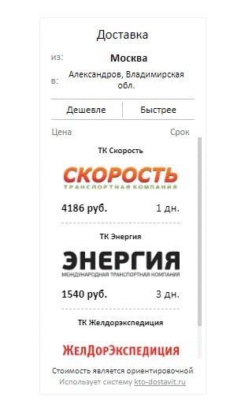

# Виджет "Цена доставки"

## Содержание

* [Описание](#desc)
* [Прямое использование](#use)
* [Использование с целью посмотреть](#look)

<a name="desc">
## Описание
</a>

Данный виджет создан для интернет-магазина и считает стоимость доставки товара из Москвы до местоположения клиента.
IP адрес клиента определяется wordpress плагином Cf-geoplugin, IP адрес конвертируется в город через dadata.ru.  
Список доставок берется с сайта sbl.su



<a name="use">
## Прямое использование
</a>

**Необходимо установить:**

* Wordpress
* Cf-geoplugin

**Необходимо добавить:**

* файлы из папки js в созданную папку wp-content/themes/theme-name/js/custom-js
* файлы из папки classes в созданную папку wp-content/themes/theme-name/js/classes
* папку img в папку wp-content/themes/theme-name/js/classes
* css код и style.css добавить в custom styles
* добавить в function.php код:

```php
    function wm_classes(){
        wp_enqueue_script(
            'CityClass_script',
            get_template_directory_uri() . '/js/classes/City.js'
        );	
        wp_enqueue_script(
            'OffersClass_script',
            get_template_directory_uri() . '/js/classes/Offers.js'
        );	
    }
    function wm_scripts(){	
        wp_enqueue_script(
            'city-data-script',
            get_template_directory_uri() . '/js/custom-js/cityData.js'
        );	
        wp_enqueue_script(
            'offers-data-script',
            get_template_directory_uri() . '/js/custom-js/offersData.js'
        );	
    }
    add_action( 'wp_enqueue_scripts', 'wm_classes' );
    add_action( 'wp_enqueue_scripts', 'wm_scripts' );
```

**Требуется получить:**

Token на сайте dadata.ru для отправки AJAX-запросов.  
Полученные данные вставить в файл cityData.js в объект cityData, свойство 'dadataToken'.

<a name="look">
## Использование с целью посмотреть
</a>

Заливаем все эти файлы куда-либо и получаем token с dadata.ru